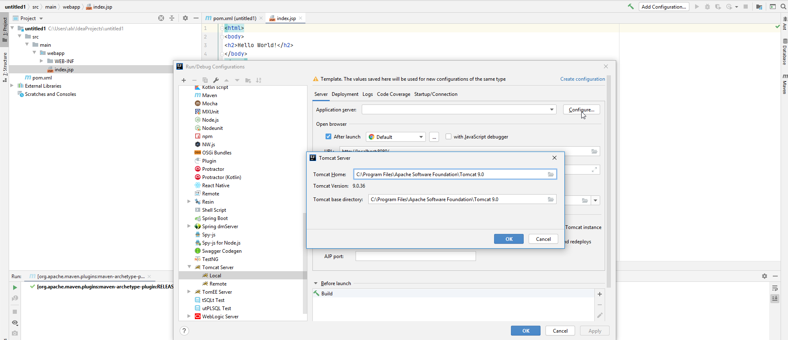

1. File -> New Project
2. Choose "Maven", check "Create from archetype" checkbox, choose "org.apache.maven.archetypes:maven-archetype-webapp" 
3. Enter project name, click "Next", click "Finish".
4. Add servlet and log4j dependencies in "pom.xml" file, then load maven changes (Ctrl+Shift+O or by clicking an icon). 
5. Click "Add Configuration" (top right corner) 
Then click "+" icon and choose "Tomcat Server -> Local" (Tomcat server should be installed already) 
You can download Tomcat here: [https://tomcat.apache.org/download-90.cgi](https://tomcat.apache.org/download-90.cgi)
6. Click "Configure", choose the directory where Tomcat Server is installed 
7. Click "Fix" and choose the first option 
then click "Apply" and "OK".
8. Now you should be able to run the project 
If you're getting errors "Address localhost:xxxx already in use" go back to step 5, and choose another port.

Sometimes you can get Tomcat shutdown error.
In that case you should go to "C:\Program Files\Apache Software Foundation\Tomcat 9.0\conf", open "server.xml" and change **Server port="-1" shutdown="SHUTDOWN"** to **Server port="1" shutdown="SHUTDOWN"**